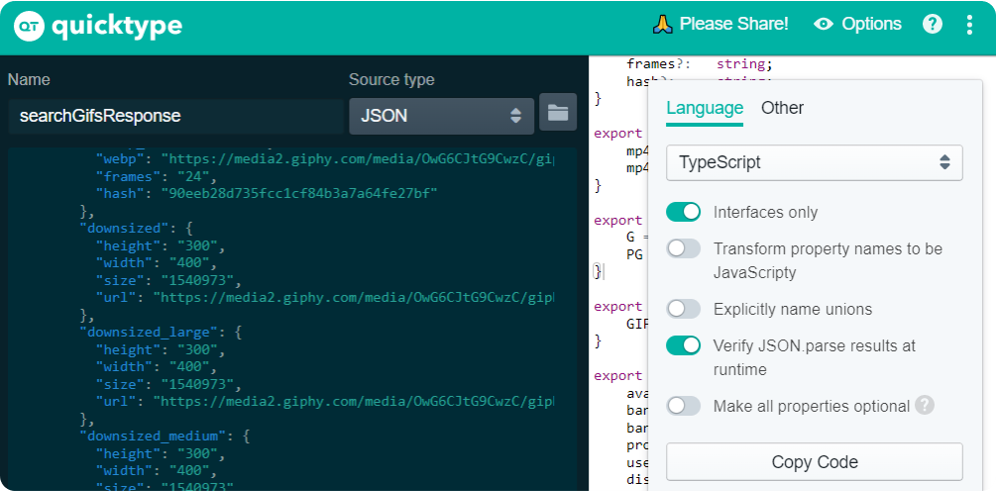

## Commits style
- 🎉 Initial commit
- 🐛 A bug fix
- ✨ A new feature
- 🔨 Doesn't fix a bug or add a function
- 🎨 Not affect the meaning of the code

## Angular CLI
- Install
```
npm i -g @angular/cli
```
- Start app
```
npx ng new [name]
```
- Run app
```
npx ng serve -o // Open browser
npx ng serve
```
- Generate module
```
npx ng g m [name]
```
- Generate module with routing
```
npx ng g m [name] --routing
```
- Generate component
```
npx ng g c [name]
```
- Generate service
```
npx ng g s [name]
```
- Generate pipe
```
npx ng g p [name]
```

## Generate node_modules
```
npm i
```

## Bootstrap5
```
<link
  href="https://cdn.jsdelivr.net/npm/bootstrap@5.1.3/dist/css/bootstrap.min.css"
  rel="stylesheet"
  integrity="sha384-1BmE4kWBq78iYhFldvKuhfTAU6auU8tT94WrHftjDbrCEXSU1oBoqyl2QvZ6jIW3"
  crossorigin="anonymous"
/>
<script
  src="https://cdn.jsdelivr.net/npm/bootstrap@5.1.3/dist/js/bootstrap.bundle.min.js"
  integrity="sha384-ka7Sk0Gln4gmtz2MlQnikT1wXgYsOg+OMhuP+IlRH9sENBO0LRn5q+8nbTov4+1p"
  crossorigin="anonymous">
</script>
```

## FontAwesome
```
<link
  rel="stylesheet"
  href="https://use.fontawesome.com/releases/v5.15.4/css/all.css"
  integrity="sha384-DyZ88mC6Up2uqS4h/KRgHuoeGwBcD4Ng9SiP4dIRy0EXTlnuz47vAwmeGwVChigm"
  crossorigin="anonymous"
/>
```

## Animate CSS
```
  <link
    rel="stylesheet"
    href="https://cdnjs.cloudflare.com/ajax/libs/animate.css/4.1.1/animate.min.css"
  />
```

## Prettier
```
npm i --global prettier
```
```
"format": "npx prettier --write ./src/app"
```
```
.prettierrc
{
	"semi": false,
	"singleQuote": true,
	"useTabs": true,
	"printWidth": 60,
	"bracketSpacing": true,
	"bracketSameLine": true,
	"htmlWhitespaceSensitivity": "ignore",
	"arrowParens": "always",
	"endOfLine": "lf"
}
```

## Typescript interfaces
- [Quicktype](https://app.quicktype.io/)


## Deploy to GitHub Pages
```
npm i -g angular-cli-ghpages
```
```
"deploy": "npx ng build --base-href \"https://a14narriaga.github.io/angular/\" && npx ngh --dir dist/angular"
```